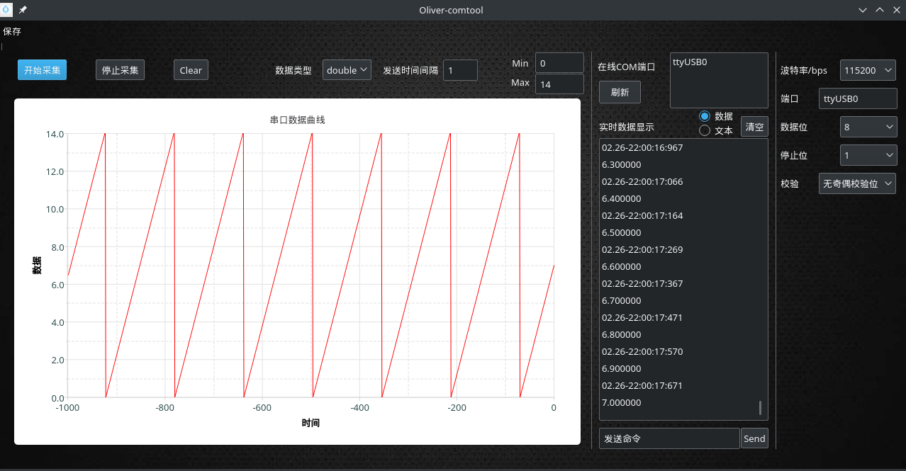

# Oliver-comtool
- 适用平台
- 需求分析
- 功能介绍
- 使用方法
- 后续改进
---
## 适用平台
适用于linux平台（本人编辑环境为Manjaro 18.0.2），请先使用qt-creator编译源码，或写makefile指定qt库所在路径后使用gcc编译。
## 需求分析
1. 测试单片机的ADC驱动，可直接通过串口观察采集到的数据波形，而不需要后级接入DAC或通过读数值进行模糊判断。
2. 进行数值分析，可直接读txt文件，进行数据拟合，无需手动记录或复制粘贴。
## 功能介绍

1. 可选择读取文本或读取数据，当选择读取文本后，只在文本框中显示读到的字符串，而不绘制曲线。
2. 选择读取数据时，

    文本框中一条数据的格式为：
[采集到数据的时间：][数据]

    而在左边则绘制出数据对应的时域曲线。0对应当前时刻。

    数据格式:
        
        C/C++:  double、int和float
        rust:   f64、i32和f32
3. 文本框和曲线部分均可清除。
4. 可保存最近采集到的1000个点，并写入txt文件，可将曲线保存为png图片。txt和png均已点击保存的时刻命名，保存到在可执行文件所在目录的Image和Text文件夹中。
5. 可对下位机发送数据（无自动添加换行）。
## 使用方法
> 第一步：点击刷新按钮，寻找到可用和需要用的端口名；

>第二步：将端口名写入右边的端口文本框；

>第三步：选择模式——数据或文本；

>第四步：设置下位机每发送两次数据的时间间隔（默认为1，即使不设置也可以有曲线，设置后方便根据横轴估测时间）；

>第五步：设置纵轴的范围——最大值Max以及最小值Min；

>第六步：点击开始采集。开始采集后若想停止就点击停止采集。
## 后续改进
需要增加或改进的地方有：
1. 多通道采集；
2. 根据曲线拟合函数的功能；
3. 选择不同编码格式来显示文本的功能；
4. 定时发送功能；
5. rts、dts启动。
6. 直接发布。由于本人采用gcc版本为8.2.1，较新，难以将在本人环境下编译好的可执行文件打包发布到其它平台，故需要编译源码。后续可能降低gcc版本以求得打包后的兼容性。